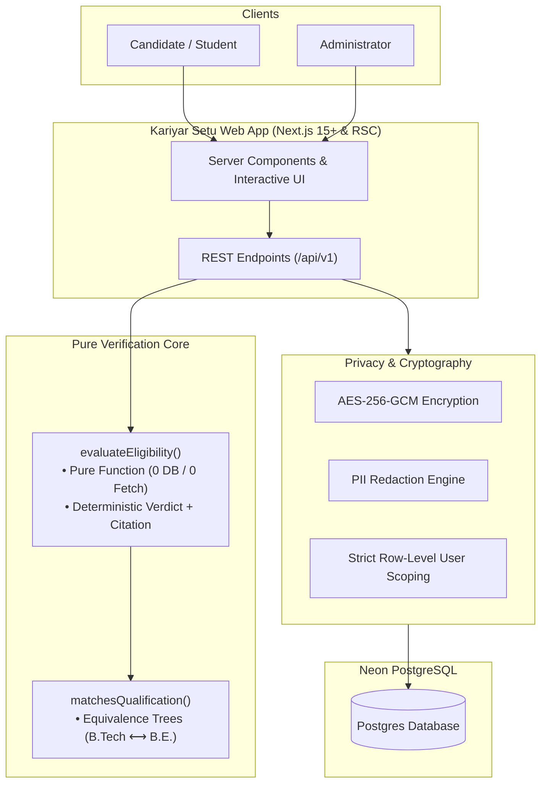

# Kariyar Setu

> **Every other platform recommends opportunities. We decide eligibility, and we cite the rule that decided it.**

An eligibility verification platform for Madhya Pradesh government opportunities and welfare schemes. A student enters their details once. The system tells them, for every ingested government notification and welfare scheme: which ones they can apply for, which ones they cannot (with the exact clause that blocks them), and which ones they will become eligible for, and when.

---

## Live Deployment

- **Production URL:** [https://kariyar-setu.vercel.app](https://kariyar-setu.vercel.app)

---

## System Architecture



> For deep architectural dives, verification sequence diagrams, and ingestion pipelines, see [docs/architecture.md](docs/architecture.md).

---

## Getting Started

### 1. Clone & Install Dependencies

```bash
git clone git@github.com:Shawaiz22/job-setu.git
cd job-setu
npm install
```

### 2. Configure Environment

Copy `.env.example` to `.env.local` and provide your secrets:

```bash
cp .env.example .env.local
```

Required keys:

- `DATABASE_URL`: Connection string for Neon serverless PostgreSQL.
- `AUTH_SECRET`: Secret key for session encryption.

### 3. Verify Database Connection

```bash
npm run db:check
```

### 4. Run Development Server

```bash
npm run dev
```

Open [http://localhost:3000](http://localhost:3000) to view the application.

---

## Standard Commands

| Command                 | Description                                         |
| :---------------------- | :-------------------------------------------------- |
| `npm run dev`           | Start development server with Turbopack             |
| `npm run build`         | Compile and validate production bundle              |
| `npm run test`          | Run Vitest test suite                               |
| `npm run test:watch`    | Run Vitest in interactive watch mode                |
| `npm run test:coverage` | Generate test coverage report                       |
| `npm run lint`          | Run ESLint checks                                   |
| `npm run lint:fix`      | Automatically fix ESLint issues                     |
| `npm run format`        | Format repository code with Prettier                |
| `npm run format:check`  | Verify formatting consistency                       |
| `npm run typecheck`     | Run TypeScript compiler type check (`tsc --noEmit`) |
| `npm run db:generate`   | Generate Drizzle schema migrations                  |
| `npm run db:push`       | Push Drizzle schema to Neon database                |
| `npm run db:studio`     | Launch Drizzle Studio database viewer               |
| `npm run db:check`      | Run live connection verification test               |

---

## Attribution

This project is built using:

- **Framework:** [Next.js 15+](https://nextjs.org/) (App Router, Turbopack)
- **Language:** [TypeScript](https://www.typescriptlang.org/)
- **Styling:** [Tailwind CSS](https://tailwindcss.com/) & [shadcn/ui](https://ui.shadcn.com/)
- **Database & ORM:** [Neon Serverless Postgres](https://neon.tech/) & [Drizzle ORM](https://orm.drizzle.team/)
- **Validation:** [Zod](https://zod.dev/)
- **Testing:** [Vitest](https://vitest.dev/) & [Testing Library](https://testing-library.com/)
- **Hosting:** [Vercel](https://vercel.com/)
