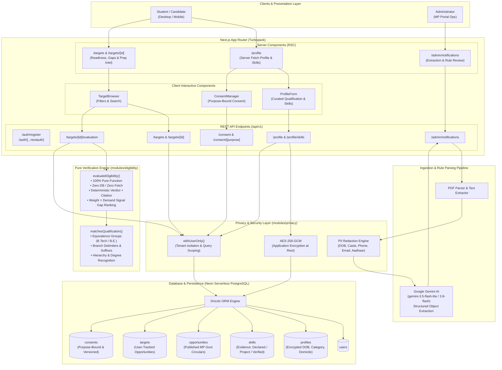
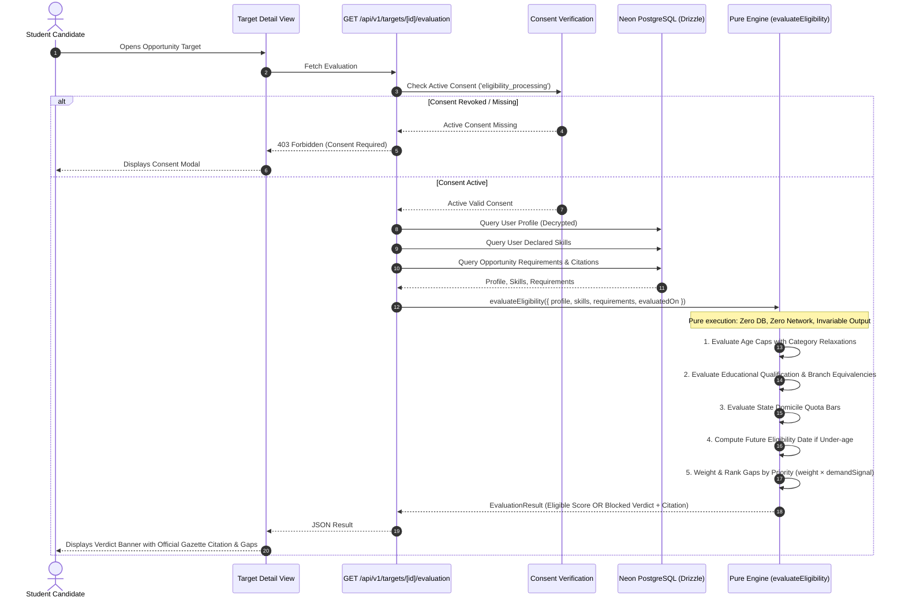
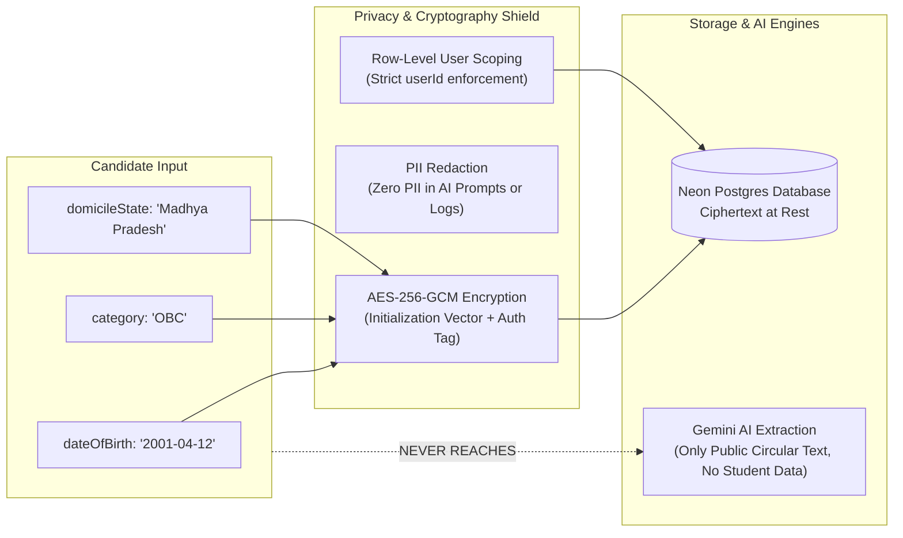
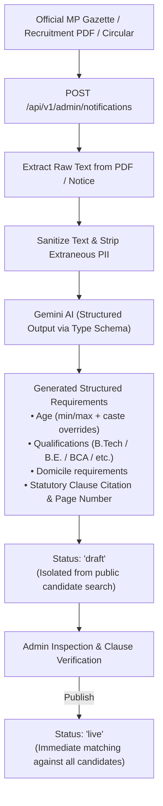

# Kariyar Setu — System Architecture & Data Flow

> **"Every other platform recommends opportunities. We decide eligibility, and we cite the rule that decided it."**

---

## 1. High-Level System Architecture

The following diagram illustrates the complete end-to-end architecture of Kariyar Setu, spanning the Next.js frontend, authentication & session management, pure eligibility verification engine, AI ingestion pipeline, and secure encrypted persistence with Neon PostgreSQL.

---

## 2. Pure Eligibility Verification Flow

Unlike platforms that use probabilistic recommendations, Kariyar Setu executes a **deterministic, zero-I/O pure function** to evaluate candidate eligibility.

---

## 3. Privacy & Sensitive Data Architecture

Madhya Pradesh candidates input sensitive personal attributes (`dateOfBirth`, `category` / caste reservation, `domicileState`). These are safeguarded via multiple layers:

---

## 4. Opportunity Ingestion & Rule Parsing Pipeline

